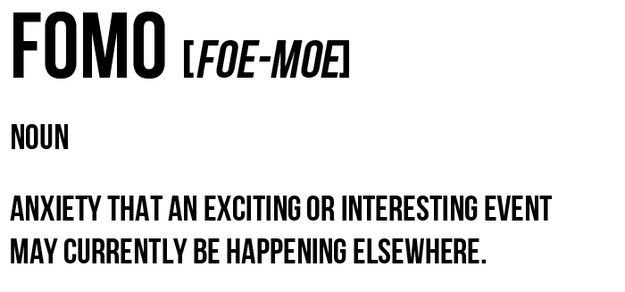
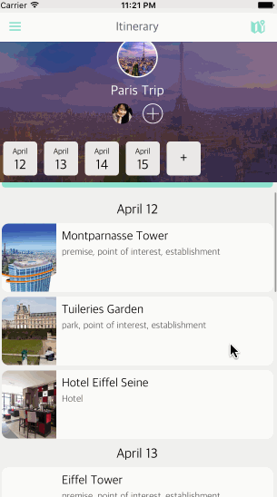
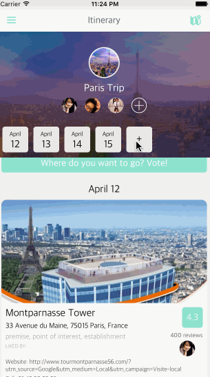

# Fomo

Authors: Christian Deonier, Connie Yu, Jennifer Lee

Fomo is a travel app for planning group trips. Simply enter dates and a destination, and you'll be presented with suggested itinerary options to upvote/downvote. You can invite friends to join your trip, and everyone can enter their preferences and vote on activities to auto-generate the perfect customized travel itinerary for your group.

## Walkthrough

Video: Coming soon!

### Create and Invite friends.

### Browse and Explore locations.

### Hamburger Menu:

GIF created with [LiceCap](http://www.cockos.com/licecap/).

## **Core** features:

A trip organizer can:
- Invite guests to the trip
- Modify trip details

Both trip collaborators and organizers can:
- Browse suggested itinerary options
- Vote on activities
- View activity details
- View the current trip itinerary
- Sign in
- Set profile preferences

Features:
- Specify RSVP/commitment status for a trip
- Add multiple destinations to a single trip
- Comment/chat/messaging system
- Drag and drop to re-arrange itinerary items
- Map view - pins colored by day
- Accommodations
- Flights
- Expenses
- Shake device to go back/undo
- Roulette to select a random location on the world to travel to

## Wireframe
[Click to comment](https://redpen.io/no4347182a45a983de):

![image]
(https://raw.githubusercontent.com/jennify/Fomo/master/wireframe.png)

## License

    Copyright 2016 Jennifer Lee, Christian Deonier, Connie Yu

    Licensed under the Apache License, Version 2.0 (the "License");
    you may not use this file except in compliance with the License.
    You may obtain a copy of the License at

        http://www.apache.org/licenses/LICENSE-2.0

    Unless required by applicable law or agreed to in writing, software
    distributed under the License is distributed on an "AS IS" BASIS,
    WITHOUT WARRANTIES OR CONDITIONS OF ANY KIND, either express or implied.
    See the License for the specific language governing permissions and
    limitations under the License.
